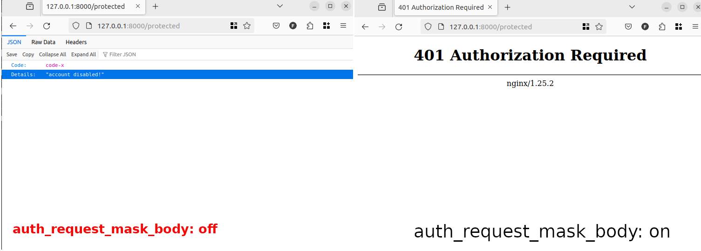

### Nginx extended auth request module

The nginx auth request module is a helpful module when you want to authenticate your requests before resolving them. [Nginx already has the module added](http://nginx.org/en/docs/http/ngx_http_auth_request_module.html) and you can use it like this: 

```
     location = /auth {
          internal;
          proxy_pass http://auth-service.local;
     }

     location /protected {
          auth_request /auth;
     }

```

This module along with other Nginx auth modules are designed to return Nginx default 401 authentication error page. In some cases, there is a need to disclose original auth error response to the outside world. In such usecases exposure of auth api response might be considered a bit risky but nevertheless necessary. 

This module strives to enable Nginx auth module to expose origin error responses when necessary. Here is how: 

```
     location = /auth {
          internal;
          proxy_pass http://auth-service.local;
     }

     location /protected {
          auth_request /auth;
          auth_request_mask_body off; # default on
          # ...
     }

```

You can see the difference when you switch `auth_request_mask_body` off in the below: 



